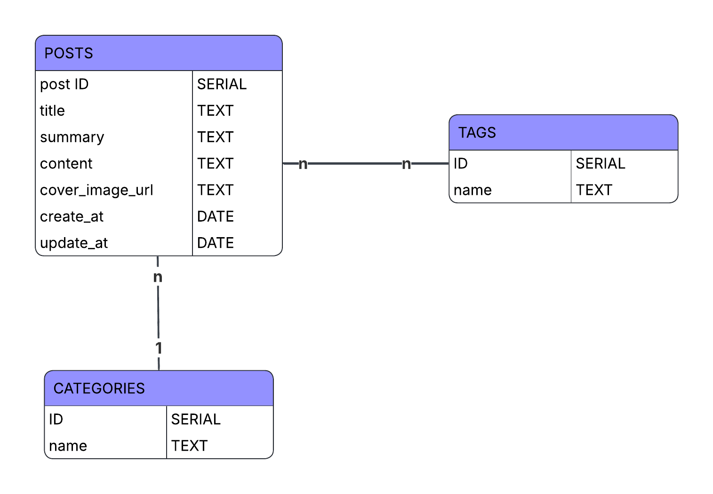

# Blog Node-Postgres API

A robust **Node.js (Express)** and **PostgreSQL** backend engine for a blog system. It features a normalized 4-table schema, handles complex many-to-many relationships, and supports transactional data integrity.

## 🛠️ Tech Stack

- **Runtime**: Node.js
- **Framework**: Express.js
- **Database**: PostgreSQL
- **Driver**: Node-Postgres (`pg`)
- **Content Parsing**: `gray-matter` (to parse Markdown frontmatter)
- **Environment**: `dotenv`

## 🗄️ Database Architecture


The project uses a normalized schema with 4 tables:
1. **`categories`**: Stores unique blog categories.
2. **`posts`**: Stores the main content, linked to a category via a foreign key.
3. **`tags`**: Stores unique tags.
4. **`tags_posts`**: Junction table for the many-to-many relationship between posts and tags, featuring `ON DELETE CASCADE`.
## 🏁 Getting Started

### 1. Clone the folder
```bash
git clone https://github.com/shuwangs/techtonica-assignments.git
cd techtonica-assignments/projects/blog_api
```

### 2. Database Setup

Create your database in PostgreSQL and run the provided script to set up the tables:

```bash
psql -d your_db_name -f db/schema.sql
```


### 3. Environment Configuration

Create a `.env` file in the root directory and add your credentials:
```
PORT=5001
DB_USER=your_username
DB_HOST=localhost
DB_NAME=blogdb
DB_PASSWORD=your_password
DB_PORT=5432
```

### 4. Installation
```bash
npm install
```

### 5. Bulk Data Ingestion (Seeding)

Place your Markdown files in the `./posts_md` folder and run the seeder script to sync them to the database:

```bash
node ./utils/seedPost.js
```

### 6. Start the Server

```bash
npm run dev
```

## 📡 API Endpoints

| **Method** | **Endpoint**     | **Description**                                                  |
| ---------- | ---------------- | ---------------------------------------------------------------- |
| **GET**    | `/api/blogs`     | Fetch all posts with aggregated tags and category names.         |
| **GET**    | `/api/blogs/:id` | Fetch full details of a single post by ID.                       |
| **POST**   | `/api/blogs`     | Create a new post with transactional safety across 4 tables.     |
| **PUT**    | `/api/blogs/:id` | Update a post and synchronize tag associations.                  |
| **DELETE** | `/api/blogs/:id` | Delete a post and its junction table associations automatically. |
## 💡 Key Features

- **Atomic Transactions**: Uses `BEGIN/COMMIT/ROLLBACK` for `POST` and `PUT` operations to ensure data consistency across multiple tables.
- **Smart Upserts**: Implements `ON CONFLICT` clauses to handle existing categories and tags gracefully.
- **Optimized Queries**: Uses SQL `ARRAY_AGG` and `GROUP BY` to retrieve post metadata and multiple tags in a single efficient database round-trip.
- **Recursive Syncing**: The `PUT` method uses a "delete-and-reinsert" strategy for tags to maintain a clean state in the junction table.
