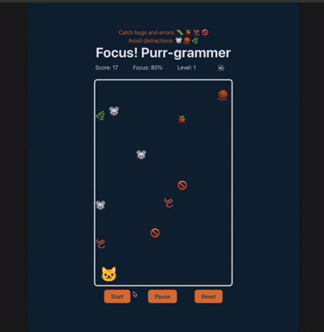

# Focus! Purr-grammer 🐱💻
A React-based arcade game where you help a coding cat stay focused by catching bugs and avoiding distractions.

[Play Demo](https://focus-purr-grammer.vercel.app/)


 
## 📖 About The Project

**Focus! Purr-grammer** is a fast-paced falling-object arcade game built with **React**.  
You play as a developer cat who must maintain focus to finish coding tasks.

The goal is simple:
- Catch **work items** (bugs, worms, errors) to increase your score
- Avoid **distractions** (mice, yarn balls, catnip) that drain your focus

As the game progresses, the **level increases**, causing items to fall faster and spawn more frequently—challenging both your reflexes and your ability to stay focused.

---

### 🎮 How to Play
- Controls: Use Left Arrow and Right Arrow keys to move the cat.
- Goal: Keep your Focus meter above 0%.
- Game Over: If your Focus drops to 0, the game ends.
  
---

## 🧩 Item Guide
| **Type** | **Items** | **Effect**|
|:--------------|:--------------|:--------------|
|Work (Catch these!)|	🐛 🐞 🪱 🚫	|+Score |
|Distractions (Avoid!)|	🐭 🧶 🌿	|-Focus |

## ✨ Features

- **Dynamic Difficulty System**  
  A level-based timer increases difficulty every 20 seconds, making items fall faster and spawn more frequently.

- **Smooth Falling Mechanics**  
  Physics-inspired falling behavior implemented using React hooks and interval-based game loops.

- **Score Tracking**  
  Real-time score updates with support for high-score tracking.

- **Responsive Keyboard Controls**  
  Global keyboard listeners enable smooth and responsive cat movement.

- **State-Driven Game Logic**  
  Game states such as *idle*, *running*, *paused*, and *game over* are managed through React state.

---
## 🛠️ Tech Stack
- Frontend: React.js (Hooks: useState, useEffect)
- Styling: CSS3 (Flexbox, Animations)
- Build Tool: Vite 

## 🚀 How To Run
To run this project locally:


1.  **Clone the repository**:
    ```bash
    git clone https://github.com/shuwangs/techtonica-assignments.git
    ```

2.  **Navigate to the project directory**:
    ```bash
    cd projects/focus_purr-grammer
    ```

3.  **Install dependenciesr**:
    ```bash
    npm install
    ```
4. **Run locally**:
    ```bash
    npm run dev
    ````

  You will see `Local: http://localhost:5173/`, right click it.
  

## 🔮 Future Improvements
- add different sound effect to both `fix the bug` and `attempted to play`. 
- Refactor GameBoard domain/game logic into a separate hook (e.g., `useGameEngine`) to improve separation of concerns and maintainability.
- Improve UX: reduce the initial delay on the first key press so movement feels immediately responsive 

## 🤝 Acknowledgements

* This project was created during my time at [**Techtonica**](https://techtonica.org/), a non-profit program that bridges the tech gap. Special thanks to my mentors and peers for their code reviews and feedback.

* Cat icon provided by [SVG Repo](https://www.svgrepo.com/svg/395984/cat-face).
  
---

## Author 
**Shu Wang**
- [portfolio](https://shu-su-wang.vercel.app/)
- [Github](https://github.com/shuwangs)