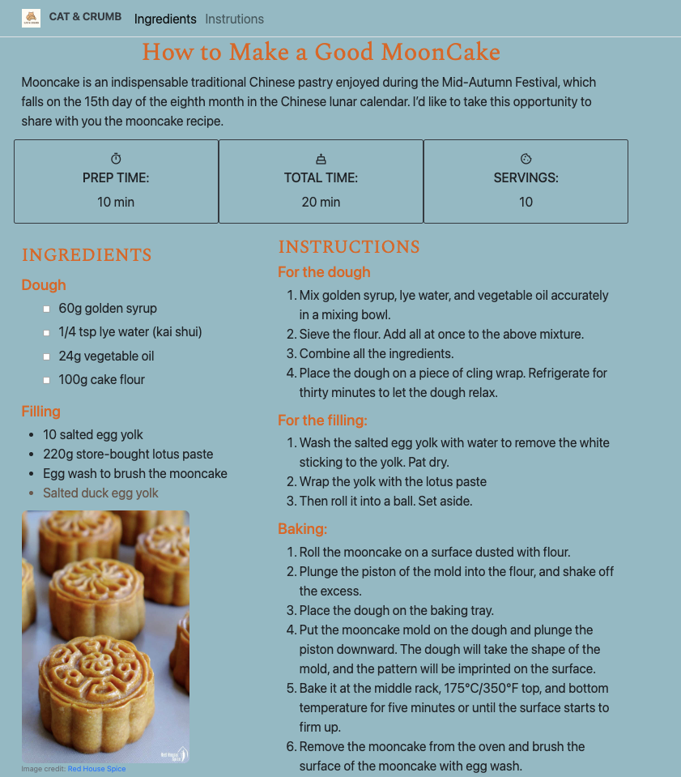

# 🥮 Recipe Page – How to Make a Good Mooncake

A responsive and interactive **recipe webpage** built with **HTML, CSS (Bootstrap)**, and **JavaScript DOM manipulation**.  
This project demonstrates core front-end development concepts such as layout design, responsive styling, and interactive UI logic.

## 🌕 Overview

Mooncake is a traditional Chinese pastry enjoyed during the Mid-Autumn Festival.  
In this project, I designed a recipe page that presents the process of making mooncakes with clean layout, clear structure, and interactive features.

## 🧩 Features

### 🏗️ Structure & Layout
- Built with **HTML5** and **Bootstrap 4**.
- Organized sections including:
  - Navigation bar with logo and links  
  - Header with recipe introduction  
  - Preparation time cards  
  - Ingredients and instructions  
  - Embedded YouTube video and contact form  
  - Footer with author info and social links
- Fully **responsive layout** that adapts across devices.

### 🎨 Styling
- Custom color palette inspired by mooncake tones.  
- **Google Fonts:** Spectral, Rubik.  
- **Bootstrap Icons** and **Material Symbols** for visual enhancement.  

### ⚙️ JavaScript DOM Manipulation
- Dynamically adds a new ingredient to the filling list:
- Automatically generates checkboxes for each dough ingredient.
- Adds an interactive strikethrough effect when the recipe description is clicked.

### 📺 Multimedia & Interaction
- Embedded a YouTube video to complement the recipe visually.
- Contact form for user feedback (email + message + submit button).
- Author info and links to LinkedIn and GitHub for personal connection.

### 💻 Technologies Used
| Category         | Tools / Libraries                                  |
|------------------|----------------------------------------------------|
| Markup           | HTML5                                              |
| Styling          | CSS3, Bootstrap 4, Google Fonts, Bootstrap Icons   |
| Scripting        | JavaScript (ES6)                                   |
| Media            | YouTube embed                                      |
| Version Control  | Git + GitHub                                       |

## 🚀 How to Run
1. Clone this repository:
  ```bash
  git clone https://github.com/yourusername/recipe-page.git
  cd recipe-page
  ```
2. Open recipe_page.html in your browse.

### Preview


### ✨ Author
**Shu Wang**  
🐾 Paws on the Keyboard  
📧 swang3130@gatech.edu  
💼 [LinkedIn](https://www.linkedin.com/in/shuuwang/)   
💻 [GitHub](https://github.com/shuwangs)


### 🐱 Acknowledgements

This project is part of the **Techtonica** Web Foundations learning program.  

Inspired by my love for baking and my cat, **Bobo** 🐾.

“A little sweetness, a little code — that’s how I bake my learning journey.”


