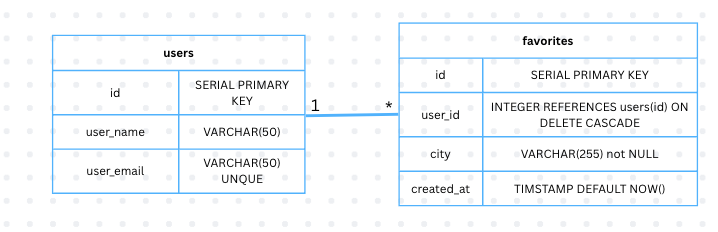

# 🌦️ Weather App – Full Stack

A full-stack weather application that allows users to search weather information by city name or geolocation. The app features a React frontend, a Node.js backend, PostgreSQL database, optional Redis-based caching, and a dynamic UI that adapts to day/night conditions.

---

## Preview


---


## ✨ Features
- Search real-time weather data by city name
- Support geolocation-based weather lookup (with browser permission)
- Backend service fetches data from the OpenWeather API
- Optional Redis caching layer to reduce repeated API calls
- Dynamic dashboard background based on day/night status
- Clear UI indicators for cached vs live data
- Add and remove favorite cities

--- 

## 🧱 Tech Stack
**Frontend**
- React,  Vite, JavaScript,  CSS

**Backend**
- Node.js, Express, OpenWeather API
  
**Database**
- PostgreSQL

**Caching (Optional)**
- Redis (local or managed)
  
--- 
## Database Schema



##  Getting Started (Local Development)

### 1. Clone the repository
```bash
git clone https://github.com/shuwangs/techtonica-assignments
cd projects/weather-app
```

### Install dependencies
Server:
```bash
cd server
npm install
```

Client:
```bash
cd ../client
npm install
```
### Environment Setup
backend:

```bash
copy .env.example .env
```
Update values:
```bash
PORT=3001
PGPORT=5432
PGDATABASE=weather_app_db
API_KEY=YOUR_OPENWEATHER_API_KEY
```
Client:
```bash
copy .env.example .env
```
Update values:
`VITE_API_BASE_URL=http://localhost:3001`


### If you dont have redis installed
```bash
	brew install redis
	brew start service redis 
```
### Database setup
Create database:
```bash
createdb weather_app_db
```
Run schema and seed
```bash
cd server

psql -d weather_app_db -f schema.sql
psql -d weather_app_db -f seed.sql
```
### Run the app
Start backend
```bash
	cd server 
	npm run dev
```
Start backend
```bash
	cd client 
	npm run dev
```

---
### Testing
Run tests:
```bash
cd client
npm run test
```

##  How to Test

### City-based search

- Enter a city name and submit
- Weather data should be displayed in the dashboard
### Geolocation-based search

- Allow browser location access when prompted
- Weather data for the current location should be displayed

### Without Redis (default)

- Do not start Redis
- App should still function normally
- UI indicates data is fetched from the API

### With Redis enabled (optional)

- Start Redis locally
- Restart backend server
- Search the same city multiple times
- Cached responses should be returned

### Favorites
- Add a city to favorites
- Verify it appears in the list
- Delete a favorite city
- Verify it is removed


## Future Improvements
- Improve UI/UX 
- Add integration and E2E tests
- User session persistence
- Valid addFavorite City to avoid duplicate 
