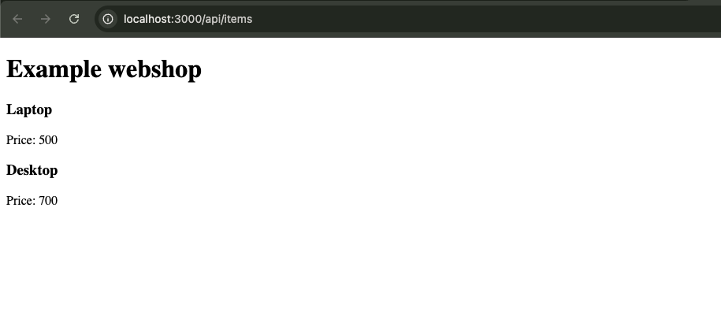

## Week 14 Quiz - Debugging, Git, & GitHub

You have just joined your favorite company and have been tasked with printing new data to a webpage. However, the existing files/directories are all jumbled up, and the code seems to have errors. Fix the bugs and sile structure. 

1. Debug the broken code so that it's working
2. Correct the file architecture using command line
3. node_modules are committed, remove them from repo on GitHub
4. Correct the server file’s directory by moving it to the appropriate directory
5. Update README with
    - screenshot of the app's webpage, 
    - document errors you encountered and how you fixed them, 
    - detail the git commands you used to remove the node_modules, and
    - detail the git commands you used to correct the file structure


## Debugging
1. Fix the `.map()` bug
Used `items.name` / `items.price` instead of `item.name` / `item.price`.
2. Fix the fetching bug
replace `req` with `res`;
```js
  useEffect(() => {
    fetch("/api/items")
      .then((res) => res.json())
      .then((data) => setItems(data));
      
  }, []);
```

3.  move server out of client into Week14_Quiz1/server
```bash
mv client/server ./server
``` 

4. my parent folder come with .gitignore that ignores mode_modules.
but can still add those to .gitignore in this file.

## Screenshot 
